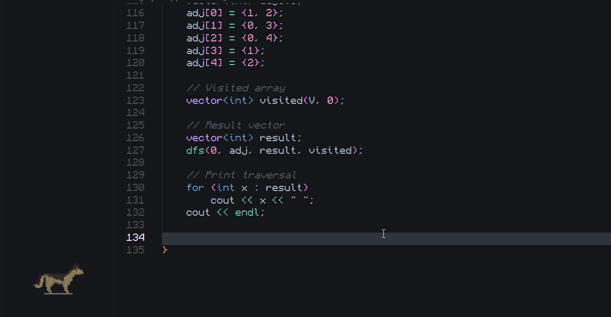
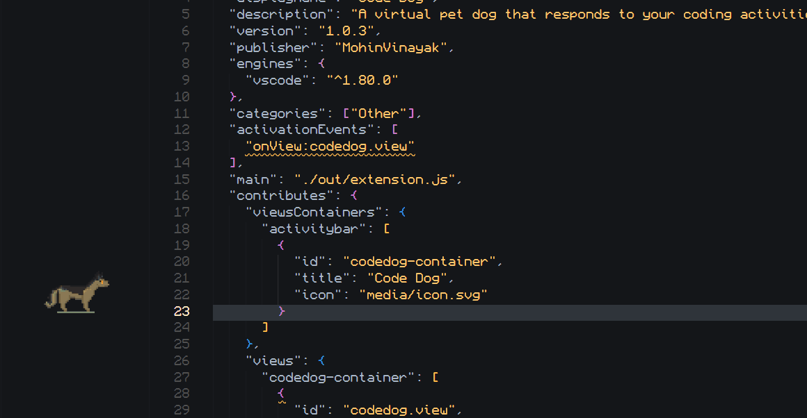

# Code Dog 

A delightful VS Code extension that adds an animated pixel-art dog companion to your sidebar. Watch your coding buddy react to everything you do!

[](https://marketplace.visualstudio.com/items?itemName=MohinVinayak.code-dog)
[](https://marketplace.visualstudio.com/items?itemName=MohinVinayak.code-dog)

## See it in Action!
<p align="center">
  
</p>
<p align="center">
  
</p>

##  Feautres

###  Smart Animations

Your dog responds naturally to your coding workflow:

- **🚶 Walk** - Animates while you're typing code
- **🏃 Run** - Celebrates successful task completions and commits
- **👃 Sniff** - Curious reaction when you save files or open repositories
- **🔍 Tracking** - Follows along when you switch between files
- **🗣️ Bark** - Alerts you to errors in your code (not annoying, promise!)
- **😴 Idle Blink** - Peaceful breathing when you take a break
- **💀 Death** - Dramatic reaction to failed builds (but recovers quickly!)

###  Interactive Features

- **Click to Bark** - Click on your dog to make it bark! (2-second cooldown to prevent spam)
- **Git Integration** - Dog celebrates your commits and tracks branch switches
- **Always Visible** - Lives in your sidebar, never blocking your code

###  Highly Customizable

Fine-tune your companion's behavior with these settings:

| Setting | Default | Description |
|---------|---------|-------------|
| `codedog.size` | 120 | Dog size in pixels (50-300) |
| `codedog.idleTimeout` | 10000 | Time before idle animation (ms) |
| `codedog.enableBark` | true | Enable error barking |
| `codedog.barkDelay` | 5000 | Delay before error bark (ms) |
| `codedog.deathCooldown` | 5000 | Recovery time after failure (ms) |

##  Installation

### From VS Code Marketplace

1. Open VS Code
2. Press `Ctrl+Shift+X` (or `Cmd+Shift+X` on Mac)
3. Search for "Code Dog"
4. Click Install

### From Command Palette

1. Press `Ctrl+Shift+P` (or `Cmd+Shift+P` on Mac)
2. Type: `ext install MohinVinayak.code-dog`
3. Press Enter

### Manual Installation

1. Download from [Visual Studio Marketplace](https://marketplace.visualstudio.com/items?itemName=MohinVinayak.code-dog)
2. Install the `.vsix` file

##  Getting Started

1. After installation, click the **dog icon** in the Activity Bar (left sidebar)
2. Your pixel-art companion will appear!
3. Start coding and watch it react to your activities

**Quick tip:** Click on the dog to make it bark! 🐕

##  Commands

Access these via Command Palette (`Ctrl+Shift+P` / `Cmd+Shift+P`):

- **Code Dog: Focus Code Dog** - Opens the dog panel
- **Code Dog: Test Run Animation** - Preview the run animation
- **Code Dog: Test Bite Animation** - Preview the bite animation
- **Code Dog: Play Animation** - Choose any animation to preview
- **Code Dog: Reset Dog** - Reset dog state if it gets stuck

**Keyboard Shortcut:** Press `Ctrl+Alt+D` (or `Cmd+Alt+D` on Mac) to quickly focus Code Dog!

##  What Triggers What?

| Your Action | Dog's Reaction |
|-------------|----------------|
| Typing code | Walks happily |
| Saving a file | Sniffs curiously |
| Switching files | Tracks your movement |
| Running a task | Runs excitedly |
| Task succeeds | Keeps running (celebration!) |
| Task fails | Dies dramatically, then recovers |
| Error detected | Barks once to alert you |
| Error fixed | Stops barking, back to normal |
| Making a commit | Runs in celebration!  |
| Switching branches | Tracks the change |
| Opening new repo | Sniffs around |
| Clicking the dog | Barks at you! |
| Long idle period | Gentle idle blinking |

##  Customization Examples

### Larger Dog
```json
{
  "codedog.size": 200
}
```

### Silent Mode (No Error Barking)
```json
{
  "codedog.enableBark": false
}
```

### Quick Idle Animation
```json
{
  "codedog.idleTimeout": 5000
}
```

### Instant Error Feedback
```json
{
  "codedog.barkDelay": 0
}
```

##  Troubleshooting

### Dog not showing?
- Click the dog icon in the Activity Bar (left sidebar)
- Or run `Code Dog: Focus Code Dog` from Command Palette
- Try reloading VS Code window

### Dog stuck in one animation?
- Run `Code Dog: Reset Dog` from Command Palette
- This will reset all animation states

### Barking too much?
- The dog only barks once per error now
- You can disable barking: set `codedog.enableBark` to `false`
- Or increase the delay: set `codedog.barkDelay` to a higher value

### Git reactions not working?
- Make sure you have the built-in Git extension enabled
- Open a git repository in VS Code
- Check the Output panel for "Code Dog: Git integration enabled"

##  Performance

Code Dog is designed to be lightweight:
-  Minimal CPU usage (< 1%)
-  Low memory footprint (< 10MB)
-  Smart event handling to avoid performance impact
-  Efficient sprite caching

##  Contributing

Found a bug? Have a feature request? 

- Report issues on [GitHub](https://github.com/MohinVinayak/Code-Dog/issues)
- Star the project if you like it! ⭐

##  Changelog

### [0.0.3] - Latest
-  Added click interaction - click the dog to make it bark!
-  Git integration - celebrates commits and branch switches
-  Improved error barking logic (less annoying, more helpful)
-  Better idle detection
-  Added keyboard shortcut (Ctrl+Alt+D)

### [0.0.2]
- Initial marketplace release
- Basic animations and reactions

##  License

MIT © [Mohin Vinayak](https://github.com/MohinVinayak)

##  Enjoy!

If you enjoy Code Dog, consider:
-  Starring the [GitHub repo](https://github.com/MohinVinayak/Code-Dog)
-  Leaving a review on the [marketplace](https://marketplace.visualstudio.com/items?itemName=MohinVinayak.code-dog)
-  Sharing with friends who code!

---

**Made with ❤️ and pixel art**

*Your code deserves a companion. Happy coding! 🐕*
